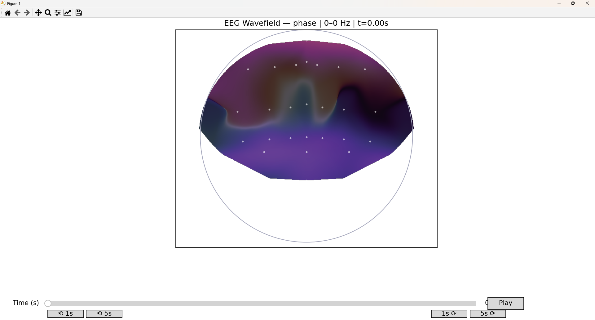
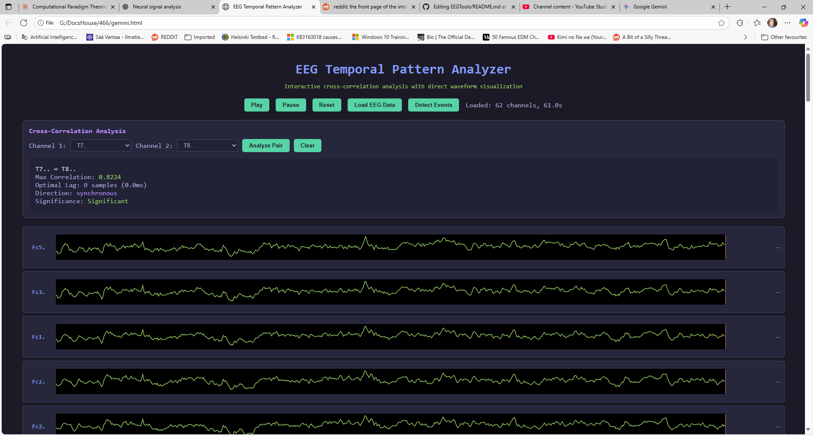

# EEG Visualization Fun Zone 🧠✨

Just a couple of experimental, not-super-serious scripts for visualizing and poking around in EEG data. 
Think of these as fun toys for signal processing, not clinical diagnostic tools!

# 1. EEG Temporal Pattern Analyzer

This is a self-contained HTML file that runs entirely in your browser. It's designed for looking at individual EEG
channel waveforms and checking out the time-lagged relationships between them.

What it does:
Loads .csv or .edf EEG files directly in the browser.

Displays all channels as scrolling waveforms.

Lets you play, pause, and scrub through the data.

Includes a simple Z-score based event detection to highlight spikes.

Features a cross-correlation analysis panel to find the time delay and correlation strength between any two channels.

Has handy keyboard shortcuts (space to play/pause, arrow keys to scrub).

How to use it:

Download gemini2.html.

Open it in a modern web browser (like Chrome or Firefox).

Click the "Load EEG Data" button and select your file.

Start exploring!

# 2. EEG Wavefield Viewer
This is a Python script that generates a dynamic, topographical "wavefield" visualization of your EEG data. 
It interpolates the signals across all electrodes to create a smooth, animated map of brainwave activity flowing across the scalp.

Prerequisites
You'll need a few Python libraries. You can install them with pip:

pip install numpy pandas matplotlib scipy pyedflib

# How to use it:

Run the script from your command line. The only required argument is the input file.

Basic Usage (Alpha band):

python eeg_wavefield_viewer_ui2.py -f your_eeg_file.edf

# Example Commands:

Here are some examples to show off what it can do.

For a super smooth, high-resolution visualization on a powerful machine:

This command sets the playback to 120 FPS and increases the interpolation grid to 512x512 pixels.

python eeg_wavefield_viewer_ui2.py -f 1.edf --fps 120 --grid 512

To analyze the Theta band (4-8 Hz) and apply a Laplacian filter for cleaner, more localized activity:

python eeg_wavefield_viewer_ui2.py -f my_data.csv --fs 256 --band 4 8 --laplacian
(Note: --fs 256 is needed to specify the sample rate for CSV files.)

# To view phase-gradient vectors and remove 60Hz power line noise:

This shows little arrows indicating the direction of wave propagation.

python eeg_wavefield_viewer_ui2.py -f subject_2.edf --vectors --notch 60

Keyboard Shortcuts (in the viewer window):

Spacebar: Play/Pause

Arrow Keys: Scrub 1 second forward/backward

Shift + Arrow Keys: Scrub 5 seconds forward/backward

m: Toggle between phase and huygens visualization modes.

v: Show/hide phase-gradient vectors.

s: Save a screenshot of the current frame.

# Licence 

MIT 

Vibecoded with ChatGPT and Gemini
